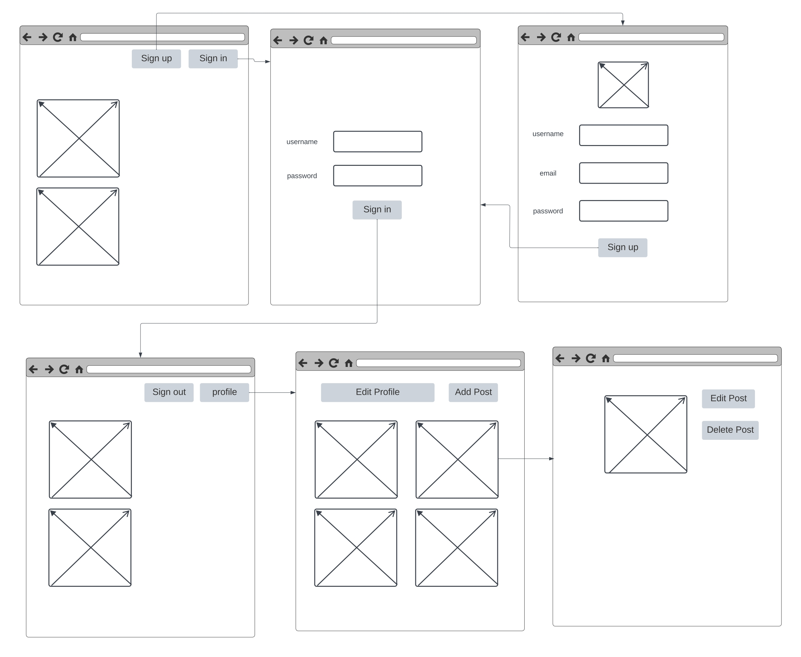

# Social-media-clone-app

## project description

Social Media app based on Express and MongooDB. The aim of this app is to let the user post images and videos as well as look at what other users posted. User has to sign up in order to get all the features which is posting and commenting ...

## Features

- Create and edit user profile
- create, edit, delete posts and comments
- upload images and videos

## How to get started

## wireframe

## progress

view progress in Trello through this [link](https://trello.com/b/Xhr9TyW7/project-management)

## credits
